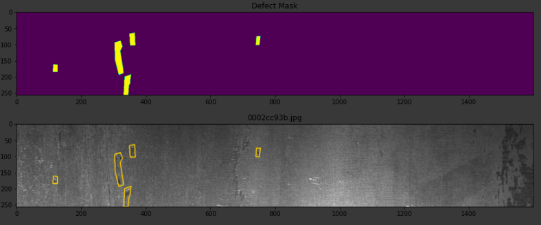
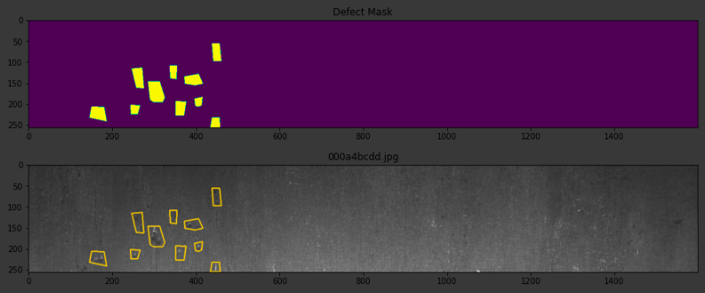
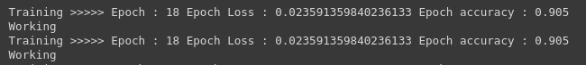
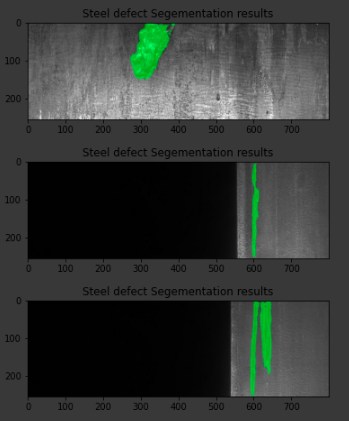
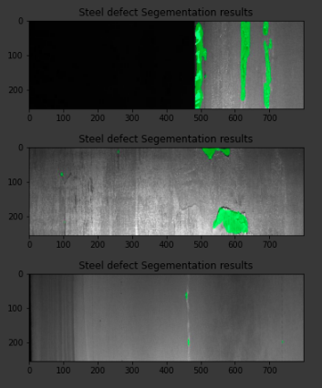

# Steel-Defect Detection Using CNN

* UNet Framework


This project consists of a implementation of how to use CNN Unet framework to identify cracks , defects on steel faces . Rather then using man power in this task deep learning framework we can introduce this technology for any defect detection systems .

* samples from the dataset



## Installation

Use the package manager [pip](https://pip.pypa.io/en/stable/) to install below packages .

```bash
pip install tensorflow==1.15
pip install opencv
pip install scipy==1.2.2
```

## Usage

```python
1. steel-defect-detection.ipynb
```

* download [kaggle dataset](https://www.kaggle.com/c/severstal-steel-defect-detection)

go through above notebook to understand how we use CNNs to capture defect on steel faces . 

## Results

* Results from UNet




## Contributing
Pull requests are welcome. For major changes, please open an issue first to discuss what you would like to change.

Please make sure to update tests as appropriate.

## License
Apache License 2.0